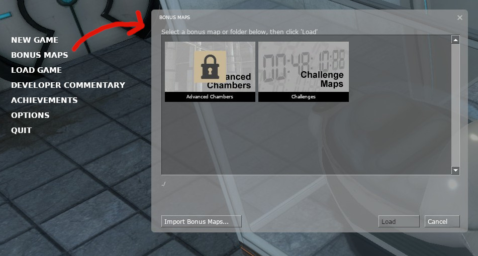

# The Process of Creating A Bonus Map
### Written by: BP
#### [Derived from the VDC](https://developer.valvesoftware.com/wiki/Bonus_Maps)

## Background:

When it comes to extra maps, the Source engine houses a feature to allow players to browse and play "Bonus Maps".
The original purpose for this feature can be seen in Portal, where it can be seen used to allow players to play a speedrun version of existing maps, or new challenge maps.

## Bonus Map Types:

In order to give more agency to the developer, there are two different forms of bonus maps:

* Single map
* Map Pack

The setup for both of these are similar, but with several, important differences.

## The Bonus Description File (.bns)

In order to allow the game to understand what maps are bonus maps, and give extra information about it, the Source engine uses bns files. The files format is based off of Valve's own [KeyValue](https://developer.valvesoftware.com/wiki/KeyValues) format.

The valid KeyValue pairs for bns files include:
#### map \<str>
  * Name of the map (without .bsp)
  * File path starts at <mod>/maps/
  * While the wiki states "./" is valid in the path, it will raise an error in the console when used on single maps.

#### image \<str>
  * A thumbnail of the map. Must be a .TGA image.
  * If this is not specified, it is assumed that the image is named the same as the bsp.

## Creating A Single Bonus Map:

Creating a map pack is extremely straightforward and simple. At minimum it only requires two files:
* The map file itself (.bsp)
* A bonus file (.bns)

If you want to enhance your bonus map, you can also add in a **TGA** image.
