# BP's Custom Map Compiler And Browser
### For Half-Life 2 Mappers and Players
### By: [BP](https://steamcommunity.com/id/builderpro/)

## Table Of Contents

>**End User**
* [What Is This?](#what-is-this)
* [Map Packs](#map-packs)
* [Installing The Browser](#installing-the-browser)
* [Uninstalling The Browser](#uninstalling-the-browser)
* [Installing Maps](#installing-maps)
* [Managing Maps](#managing-maps)
* [Installing Custom Backgrounds](#installing-custom-backgrounds)
* [Removing Custom Backgrounds](#removing-custom-backgrounds)
* [Overwriting Error](#overwriting-error)

>**Level Designer**
* [Compiling Your Own Maps](#compiling-your-own-maps-cli)
* [CLI (Command Line)](#cli-command-line)
  * [Compiling A Single Map](#compiling-a-single-map-cli)
  * [Compiling A Map Pack](#compiling-a-map-pack-cli)
* [Command Line Arguments](#cli-arguments)
* [GUI](#gui-tool)
  * [Compiling A Single Map](#compiling-a-single-map-gui)
  * [Compiling A Map Pack](#compiling-a-map-pack-gui)
  * [Thumbnail Editing](#thumbnail-editing-gui)
  * [Entry Prompts](#entry-prompts-gui)
  * [Saving / Loading](#saving--loading-gui)
* [Custom Backgrounds](#custom-backgrounds)
* [Overwriting Existing Assets](#overwriting-existing-assets)
* [Debrief](#debrief)

* [Credits](#credits)

## What Is This?
For those who have played a good amount of custom Half-Life 2 maps, you may understand that most level designers have you enter their map through means of the console. While this is the standard, it isn't a user-friendly approach. Some other people try to solve the issue by instead turning their map packs into mods. But, if the player wants to swap to a different map, not made by the developer, they would need to leave the game. That's where this tool comes in to help solve that problem.

Using the power of Source's [Bonus Map](https://developer.valvesoftware.com/wiki/Bonus_Maps) feature, we now have a means of sorting all of our installed custom maps in a single place!

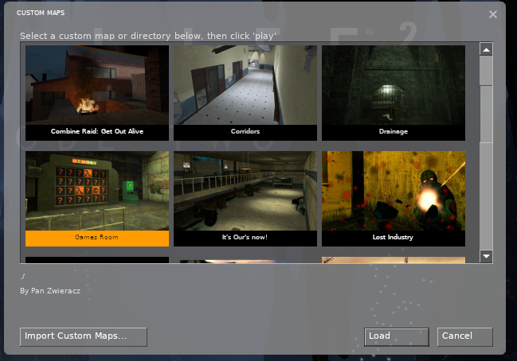

With this browser, level designer are able to:
* Create map packs, where the player can browse subdirectories filled with maps.
    * Packs inside of packs are also available for even more map!
* Catch player's attentions with the use of thumbnails.
    * With the compiling tool automatically generating the correct thumbnail specs.
* Credit themselves with the use of the comments.
* And the best part, no more needing to see an ugly bsp-friendly name. Add spaces, colons, and other characters to the name of your map!
* ~You can even pack your maps into a `.bmz` file for easier installation on the end user's side!~ Bmz support will not be added as it goes against this project's spirit of modular install/uninstall using `./custom`.

## Map Packs
Along with browsing single maps, by creating a subdirectory inside of `./maps` allows you to have a specified *map pack* in which you can give your own name, comment, and thumbnail.

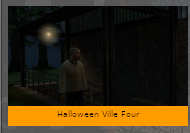
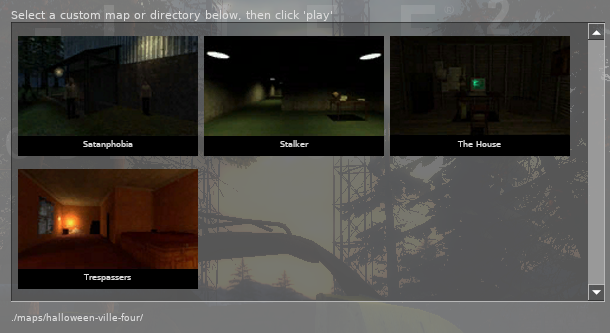

This allows for a much cleaner and modular experience for the end user.

> **TIP:** You can *lock* maps, which can then be [unlocked](https://developer.valvesoftware.com/wiki/Point_bonusmaps_accessor) when playing other maps to allow for a progression similar to that seen for the game's chapter select.

## Installing The Browser
### [You can find the download right here](https://github.com/sectopodwreck/HL2-Custom-Map-Browser-And-Tool/releases/tag/Browser)
Adding the map browser to your own game is extremely easy and unintrusive. Simply:
1. Copy the folder `./custom-map-explorer` to `[Steam Directory]/common/Half-Life 2/hl2/custom/`

And you're done.<br/>
Next time you boot up your game you will see a new menu option:

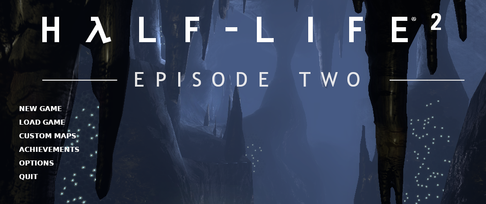

> **WARNING:** For users playing in a language other than English, you will be missing localization! To fix this, check out `./custom-map-explorer/resource/gameui_english.txt` to see what keyvals you will need to change for your own language.

> **WARNING:** Some custom maps/packs may overwrite `./cfg/game.cfg` and `./cfg/modsettings.cfg` in order to allow for warning you about the given pack's other overwriting warnings.

## Uninstalling The Browser
Deleting the browser is just as easy as installing. Just:
1. Delete `[Steam Directory]/common/Half-Life 2/hl2/custom/custom-map-explorer`

And now you're game is back to factory settings.

## Installing Maps
> **Reminder:** The level designer must of made a folder using this tool in order for it to work. You cannot just drag and drop a `.bsp` file and get the same result.

**Unless it's specified by the level designer**, it's best to play all of the maps in *Half-Life 2: Episode 2*. Because of this, be sure to:
1. Copy the given folder into `[Steam Directory]/common/Half-Life 2/ep2/custom/`

With that done, it should now show up in the browser.

## Managing Maps
As we know, when it comes to the standard way of managing custom maps, end users drag and drop the `.bsp` into their `maps/` directory without a thought. Sometimes, there's extra assets which need to be installed into `materials/` and `models/`. This leads to very messy folders.

With the power of the Source Engine's `custom/` directory, for overwriting and adding assets, we can separate each map into their own folder to allow for easy installation and deletion of custom maps.

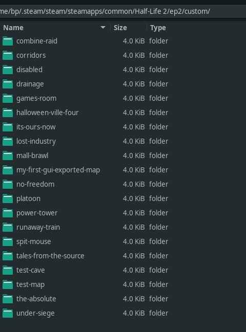

> **TIP:** In order to allow you to quickly disable addons without uninstalling, add in a `./custom/disable` directory and cut/paste the addons into there.

## Installing Custom Backgrounds
If you ever browse into your addon and you see a script called `AddCustomBackground`, you're in for a good time!

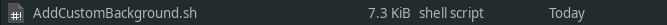

The level developer was nice enough to create a background map which you can add to your own rotation of startup menu maps.

> **WARNING:** While I have provided a bash script that is completely safe to run, always be cautious about running any scripts on your machine that you don't fully trust, *ESPECIALLY IF YOU ARE RUNNING AT A HIGHER PRIVLAGE!*

## Removing Custom Backgrounds
In the case where you want to remove the custom backgrounds, you have two different options:

#### 1. Delete `./custom/custom-backgrounds`
This is the more simpler option.

#### 2. Run `./custom/custom-backgrounds/ResetBackgrounds.sh`
Practically the same as the previous option, but this will at least preserve the addon.

## Overwriting Error
Are you getting this pop-up whenever you start your game?

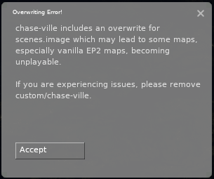

Don't worry, that's apart of this browser! Sometimes, due to the way Source works, level developers may need to overwrite important files that other maps rely on, to let the level developers do more complex scenes in their own maps. In order to work out all edge cases that may appear for this browser, this pop-up was added to give you a warning.

While the problem may be benign most of the time, it's recommended to [disable](#managing-maps) or delete the addon after you have finished playing with it.

## Compiling Your Own Maps
Alright, now for the fun part. Level designers, you wanna use this tool to spice up your presentation? I know you do. :)

Before we start, I'd like to tell any and all of you ambitious level designer to ***NEVER USE CAPITAL LETTERS IN DIRECTORIES OR FILES!*** While everything looks fine on Windows, UNIX systems, where files are CaSE senSitive will make these directories completely unreadable.

To get started, this tool hasn't been *frozen* yet, so **you will need to install [Python](https://www.python.org/downloads/)** in order to run the program. Python was chosen as I am on a Linux, and would like for this tool to be as portable as possible.

> **WARNING:** You will need to install PIL in order to run the program. To install this Python Package, simply:
```bash
python -m pip install pillow
```

To check out all arguments available, open a terminal in this directory and run the command:
```bash
python ./CustomMapCompiler.py --help
```

### CLI (Command Line)
For all you independent, empowered terminal nerds who don't need no GUI, you can still use this tool through arguments. The procedure compared to the GUI is different when it comes to creating packs, but it's still possible through the use of the [`-json`](-j---json-export-to-json) argument.

### Compiling A Single Map (CLI)
All single maps require at the very least a:
* **-s:** To clarify that you are compiling a single map.
* **--name:** To allow for building directories.
* **--map:** To give a path to a `.bsp` file.

There are also the optional:
* **--comment:** To allow for flavor text.
* **--image:** To give your map a thumbnail.
* **--lock:** To flag that this map needs to be [unlocked by playing another map](https://developer.valvesoftware.com/wiki/Point_bonusmaps_accessor).
* **--output:** To change the output directory. Default is `./exports`
* **--json:** To instead output or add onto a json file with the data of this map. Used for creating map packs.

#### Example Of Compiling A Map
Let's say we have a map which is located in a folder on our desktop. Along with that, we took a screenshot and cropped it to what we want. What we would do is **open a terminal in the this program's directory** and:

```bash
python ./CustomMapCompiler.py -s -n "The Coolest Map Ever" -c "This map was made by: BP" -m "/home/Desktop/my-map/my-example-map.bsp" -i "/home/Desktop/my-map/my-screenshot.png"
```

The finished product will now be found in `./exports`.

##### What we did with that command
* Told the tool we are compiling a single map **-s**
* Gave it the name *The Coolest Map Ever* **-n**
* Gave it the comment *This map was made by: BP* **-c**
* Gave the map's path at */home/Desktop/my-map/my-example-map.bsp* **-m**
* Gave the thumbnail's path at */home/Desktop/my-map/my-screenshot.png* **-i**

### Compiling A Map Pack (CLI)
All map packs require at the very least a:
* **-p:** To clarify that you are compiling a map pack.
* **--name:** To allow for building directories.
* **--json:** To give a list of maps which are apart of the pack.

There are also the optional:
* **--comment:** To allow for flavor text.
* **--image:** To give your map pack a thumbnail.
* **--lock:** To flag that this map pack needs to be [unlocked by playing another map](https://developer.valvesoftware.com/wiki/Point_bonusmaps_accessor).
* **--output:** To change the output directory. Default is `./exports`

#### Example Of Compiling A Map Pack
#### We need to create a list of maps first
Before we begin with making the pack, we must first make a `.json` file with all of the maps which will be inside of the pack. Let's use our map in the previous example.

```bash
python ./CustomMapCompiler.py -s -n "The Coolest Map Ever" -c "This map was made by: BP" -m "/home/Desktop/my-map/my-example-map.bsp" -i "/home/Desktop/my-map/my-screenshot.png" -j "./my-map-pack.json"
```

##### What's different
* Gave it the json path *./my-map-pack.json* **-j**

This prevents the tool from compiling a single map. Do this with all of your other maps, giving it the **-j** argument to add onto it.

#### Now for the pack itself
It's self explanatory, just like compiling a map. But, we swap out the **-s** flag for a **-p** and never use the **-m** argument. We replace it out with the **-j** argument as the input.

```bash
python ./CustomMapCompiler.py -p -n "The Coolest Map Pack Ever" -c "This pack was made by: BP" -j "./my-map-pack.json" -i "/home/Desktop/my-map-pack/my-screenshot.png"
```

That's all! You are now prepared to make your own maps and map packs for this browser!

## CLI Arguments
This is a more verbose explanation of all of the available arguments.

### -g --gui (GUI Editor)

* A more user friendly way of compiling custom maps and packs for the browser.
* It also allows for a much easier means of creating thumbnails.

```bash
-g
```

### -s (Single Map)
* Tells the tool that you will only be compiling a single map.

```bash
-s
```

### -p (Map Pack)
* Tells the tool that you will be compiling a map pack.

```bash
-p
```

### -n --name (Addon Name)
* Sets the name of the map. Along with this, it will also be used when naming your addon.

```bash
-n "The Great Mod Which Is Awesome!"
```

### -c --comment (Comment)
* Sets the text for the comment. Shown right below the path in the map browser.

```bash
-c "Made by: BP"
```

### -m --map (Map Path)
* The file path to your map (`.bsp`) file.

```bash
-m "~/Desktop/Half-Life 2/maps/my-map.bsp"
```

### -j --json (Export To Json)
* **When used on a map** it will open that `.json` file and append its data into it instead of creating a compiled folder.
* **When used on a pack** it's the contents of that map's pack. All maps within the `.json` will be compiled into a single folder.

```bash
-j "./the-cool-map-pack.json"
```

### -i --image (Image Path)
* The file path to an image file that will be used for the thumbnail.
> **NOTE:** The tool will happily scale down your image to the required size, but **the thumbnail's aspect ratio is 9:5**. If you want your image to look exactly like what you want, **be sure to crop it beforehand.**

```bash
-i "~/Desktop/Screenshots/my-map-screenshot.png"
```

### -l --lock (Lock Map/Pack)
* Tells the game that this should be locked until a [point_bonusmaps_accessor](https://developer.valvesoftware.com/wiki/Point_bonusmaps_accessor) is fired that unlocks it.

```bash
-l
```

### -o --output (Folder Output)
* Change the directory in which we output the compiled bonus map folder. The default directory is `./exports`

```bash
-o "~/Desktop"
```

## GUI Tool
It's understandable that working on the CLI is a pain for most. With the added confusion with how to set up thumbnails, it's even worse. Because of that, by running the program without any arguments, it will launch directly into the GUI tool.

```bash
python ./CustomMapCompiler.py
```
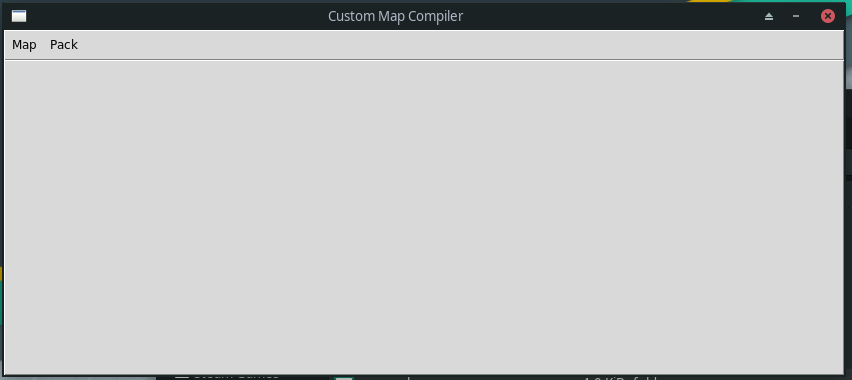

### Compiling A Single Map (GUI)
Making maps and setting up thumbnails are a breeze in this interactive editor! To start, go into the menu and select:

> Map -> New Map

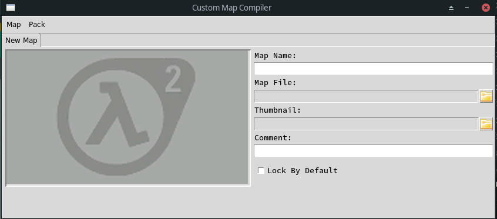

This will create a tab for a custom map instance. Filling out the data for the custom map is made simple with the given text/file prompts on the right hand side. The thumbnail viewer can be seen on the left hand side. [More information on how to utilize the viewer will be gone over later.](#thumbnail-editing-(gui))

> **NOTE:** The bare minimum needed to export a map is a **Name** and **Map File**. Everything else is optional.

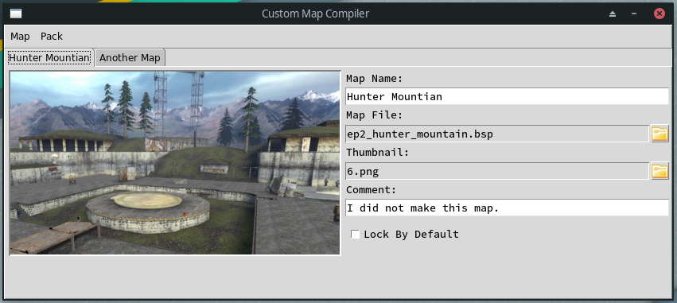

When you are ready to compile the map simply select the tab of the map you want to export and:

> Map -> Export

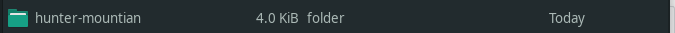

If the project already exists, it will ask you if you'd like to delete and overwrite it. After that, you will find the usable map in `./exports`. It's already set up to be a custom folder. So, you can easily add in all the custom assets into the project's folder and place it in `[Game's Directory]/custom/`

### Compiling A Map Pack (GUI)
Along with the ability to create/export single maps, the GUI tool also allows for the creation and exporting of map packs. To start, in the menu, toggle:

> Pack -> Map Pack

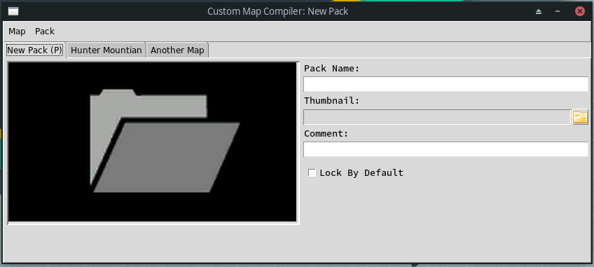

This will create a tab to the front of the set which will represent the pack's data. Just like with the map tabs, you have text/file prompts which can be filled out to give more details about your map pack.

> **NOTE:** At the very least, a pack needs a **Name**. Everything else is optional.

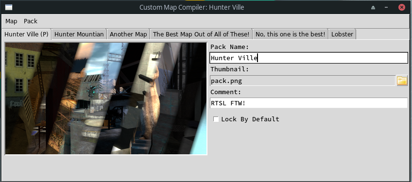

Once you stylize the pack itself, be sure to also add in all the maps you want inside of the pack in the other tabs. If you want one map to be in front of another map, or vise-versa. Select the map's tab that you want to move and:

> Pack -> Move [Left/Right]

After you feel that everything is in place, it's time to export. Simply select the pack's tab and:

> Pack -> Export

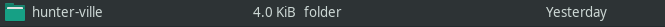

If the project already exists, it will ask you if you'd like to delete and overwrite it. After that, you will find the usable maps and the pack in `./exports`. It's already set up to be a custom folder. So, you can easily add in all the custom assets into the project's folder and place it in `[Game's Directory]/custom/`

### Thumbnail Editing (GUI)
In order to allow for quick thumbnail creation, the added viewer acts as an editor as well. You can:
* Drag the image to pan.
* Scroll with the mouse to zoom / unzoom.

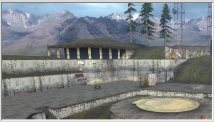

### Entry Prompts (GUI)
There are three different types of entry fields in the editor.
#### Text Entry
Allows you to input in text. Pretty self explanatory.
#### File Entry
Requires a specific file. By clicking on the folder icon, it will bring up the file browser. Clicking on the entry field, itself, will clear that entry.
#### Checkbox
This is only used to dictate if the map/pack should be locked. [Please stop by the Wiki to understand how this feature works.](https://developer.valvesoftware.com/wiki/Point_bonusmaps_accessor).

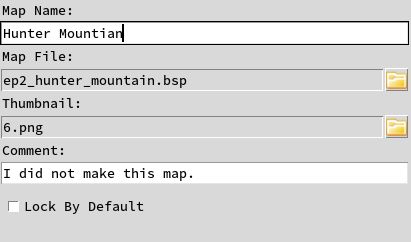

### Saving / Loading (GUI)
If you'd like to get back to work on a project, instead of exporting, you can save. What differs this from the conventional export is all of the data is saved into a `.json` file, and the files inputted only reference the path to where they originate.

You can save a map / pack by selecting the tab you want to save and:

> [Map / Pack] -> Save [Map / Pack]

#### Loading A Map
When loading a map, it will iterate over all maps in the given `.json` file and append each one to a new tab.

#### Loading A Pack
Be careful when loading a pack as it will clear all tabs and replace it with the data inside of the given `.json`.

## Custom Backgrounds
If you are an ambitious level developer who wants to go above and beyond the call of duty when publishing your work, you have the ability to add in a custom background map to the end user's start menu rotation.

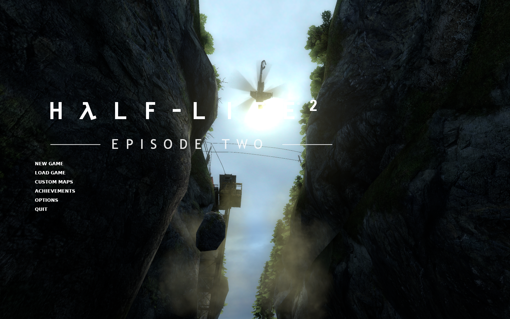

Place your background map and background materials in their respective directories.

After, copy and paste the provided script `./addon-tools/custom-background/AddCustomBackground.sh` into your addon's root directory.

Finish up by opening up the file and putting in all the names of the background maps inside of **line 11**. Each within their own string.

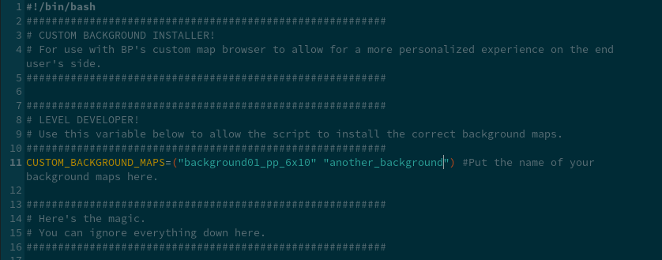

Run the script at least once while it's inside the `./custom` directory to check and see if everything works correctly. If a new addon, `custom-backgrounds`, appears everything should be good.

## Overwriting Existing Assets
It's understandable that sometimes, you can't get your map to work properly without overwriting existing assets. For example, any `.VCD` files made in the Faceposer must be compiled into a single `scenes.image` file, shared by all .vcd's and only loaded at startup.

We do not want to change these files behind our end user's back, or else they may experience difficulties in the vanilla maps or some other custom map. Because of this, the map tool also comes with the needed files to warn our user.


### Adding in the warning
To add this pop-up to your own pack, copy and paste the contents inside of `./addon-tools/overwrite-error` inside of your addon.

Next, go into `./[YOUR PACK]/resource/gameui_english.txt` in your favorite text editor and change the square brackets `[]` to whatever should go there.

> **WARNING:** Be sure the localization file is encoded in **UTF-16LE**, not UTF-8 or ASCII.

The warning should now show up in game!

## Debrief
With all that being said, you should be equipped to add or port all of your maps to this amazing browser! While it's a little late to the party, I do hope this becomes a standard tool for any HL2 level developer in order to help allow their maps to stand out and give the players an easier way to browse their own collection.

## Credits
**Zach Wallace (BP)** - Practically the entire program.

**Mark James** - [Folder Icon](http://www.famfamfam.com/lab/icons/silk/)

**Valve Developer Wiki Community** - Amazing documenting of the game
